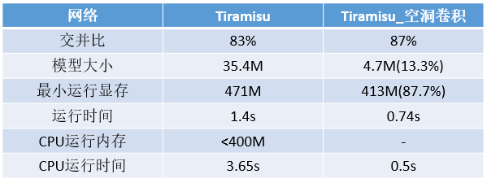

---
### 2018-09-05 ~ 2018-09-11

###  **实验** 

**实验意图与方向**：甲状腺结节分割模型的优化

**实验来源**：
- 论文[The One Hundred Layers Tiramisu: Fully Convolutional DenseNets for Semantic Segmentation](https://arxiv.org/abs/1611.09326)（简称Tiramisu）的方法
- 基于[ERFNet: Efficient Residual Factorized ConvNet for Real-Time Semantic Segmentation](https://ieeexplore.ieee.org/document/8063438/?reload=true)（简称ERFNet）的方法改进[Tiramisu](https://arxiv.org/abs/1611.09326)；
	
- [点击这里获取Tiramisu源代码](https://github.com/HasnainRaz/FC-DenseNet-TensorFlow)

**实验基础**：

- 已有结果

| 网络        | Tiramisu   |  ERFNet |
| ---------   | :-------:  | :----:  |
| 交并比      | 83%        |   82%   |
| 模型大小    |   35.4M    |   31.5M |
| 最小运行显存|    471M    |   305M  |
|   运行时间  |    1.4s    |   1.0s  |
| cpu运行内存|    <400M   |   未测  |
| 运行时间|    3.65  s    |   未测  |
- 已有数据 

甲状腺结节图像，掩码各3917张

**思路 \ 改进概述**：分割模型一般对图像下采样5次，图像缩小到原图的32倍（Tiramisu，FCN，Unet等），当下采样次数较少时，卷积核的感受野变小，导致分割效果变差；而ERFNet对输入图像仅仅下采样3次，图像仅仅缩小到原图的8倍，这时的感受野较小，分割效果也比较差，为了扩大感受野，ERFNet使用了空洞卷积：在最后一次下采样后分别使用了空洞率为2,4,8,16的空洞卷积来提取特征。这样做可以使下采样次数变少，相对应的上采样次数也变少可以有效减小模型大小和模型运行时间。在tiramisu中使用空洞卷积也可以减少下采样次数。

**可行性**：Tiramisu：空洞卷积可以有效扩大感受野，并且同时每个空洞卷积与普通卷积的参数量一样（3×3大小的卷积核参数量同为9）

**阶段性成果**：[代码、模型、及说明](https://code.aliyun.com/breaksong/DLGroup/blob/master/code/)

### **整理或总结**

简单的总结用图表、图片、文字等形式给出，表述要清楚。

### **过程中发现的问题及解决办法**
针对Tiramisu_空洞卷积这次实验，在实验中仅仅测试下采样的的时间，为0.6s左右，仅仅测试第一层卷积的时间，为0.53s左右，这个问题说明时间并没有耗费在
### **其他**
……

  [1]: https://gss2.bdstatic.com/
