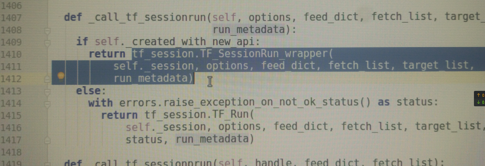


---
### 2018-09-19 ~ 2018-09-26

###  **实验** 

**实验意图与方向**：在公开数据集上实验

**实验来源**：**实验来源**：
- 论文[The One Hundred Layers Tiramisu: Fully Convolutional DenseNets for Semantic Segmentation](https://arxiv.org/abs/1611.09326)（Tiramisu）的方法
	
### **数据集**：
[CamVid](http://mi.eng.cam.ac.uk/research/projects/VideoRec/CamVid/#ClassLabels)十二分类

**思路概述**：在公开数据集上进行实验，测试之前模型改进的效果（此数据集是TIramisu原文中用的）

### **总结**

模型结构不变，增加卷积层的通道数（32）可以将交并比提高到60%，模型大小为9.8M
### **其他**
分析第一次的运行时间

### **下周计划**

完善论文对比实验，将论文未完成的部分完成

---
