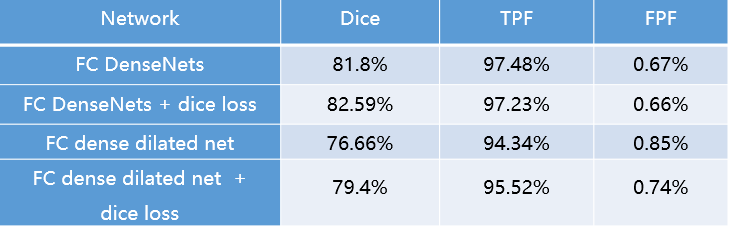


---
### 2018-10-17 ~ 2018-10-24

###  **实验** 

**实验意图与方向**：修改损失函数，提高精度，将交叉熵损失函数修改为DIce损失函数

**实验来源**：V-net

**思路概述**：目标分割区域太小，而背景区域太大，会bias模型，使得模型不准确。Dice损失函数可以有效减少模型像背景区域偏置。

**实验总结**：

对IOU没有效果
### **其他**
**FCN遇到的问题及解决办法**：模型预测的结果中转成图片后有一部分图片是正常的，一部分图片整张是黑的；最后发现是图片保存方法有问题，换一种保存方法即可。

**修改阈值实验**：没有效果

---
