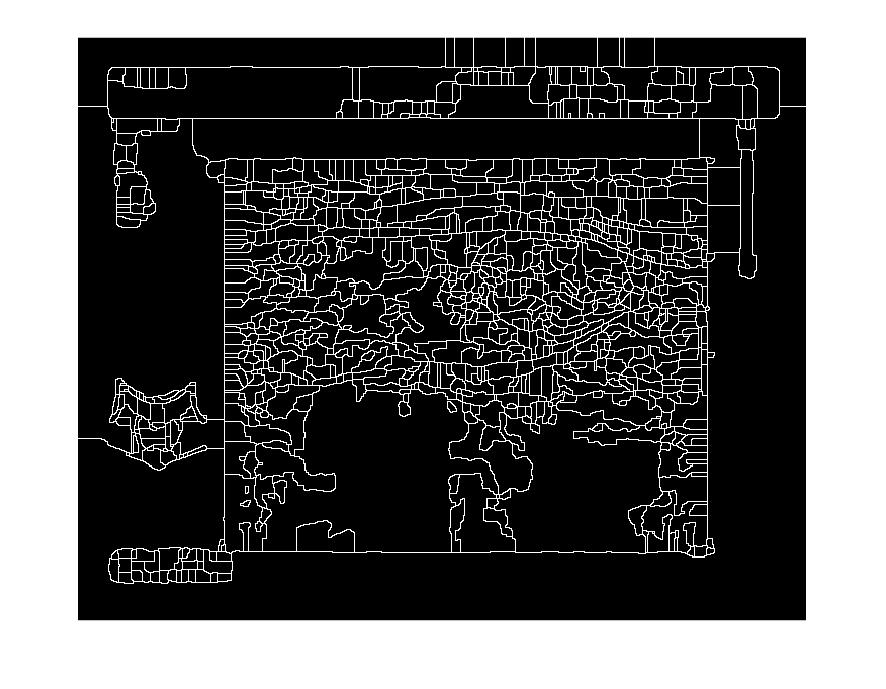

---
### 2018-11-02 ~ 2018-11-07

###  **实验** 

**实验意图与方向**：调通论文[Contour Detection and Image Segmentation Resources](https://www2.eecs.berkeley.edu/Research/Projects/CS/vision/grouping/resources.html)中的代码。

**实验来源**：[Contour Detection and Image Segmentation Resources](https://www2.eecs.berkeley.edu/Research/Projects/CS/vision/grouping/resources.html): 伯克利，2013年CVPR 的Sketch Tokens

**思路概述**：将甲状腺图像用图像学方法进行分割，然后训练一个网络将分割的每一小块进行分类，将分类结果作为该块的分割结果。

**分割效果**：

原图：

不同阈值分割结果：

原图：

不同阈值分割结果：

**接下来的实验**：构造一个适合的数据集，然后训练分类网络，得出分割结果。

### **其他**
写烟草论文

---
