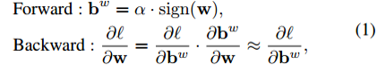
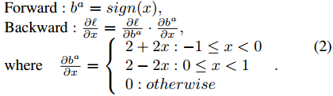
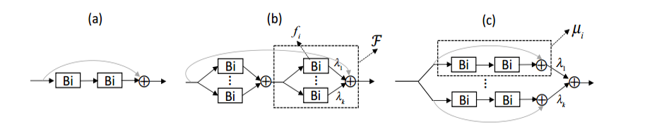
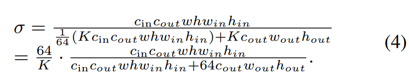
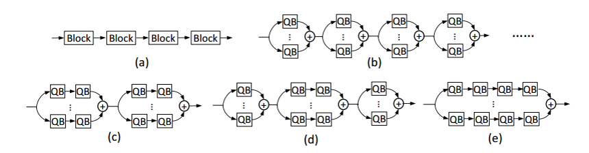
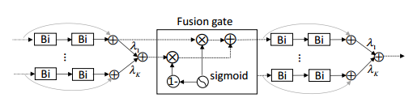
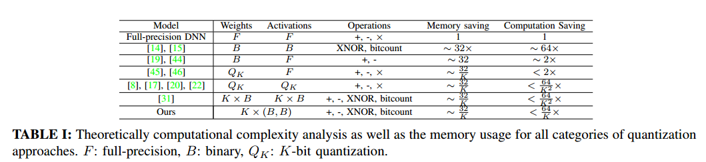
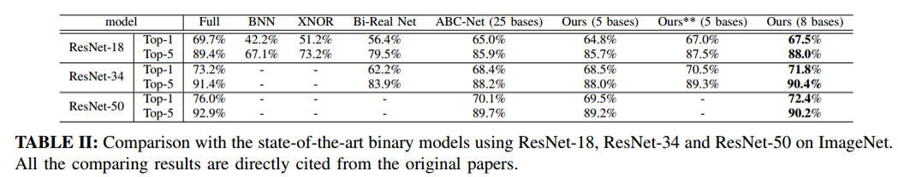
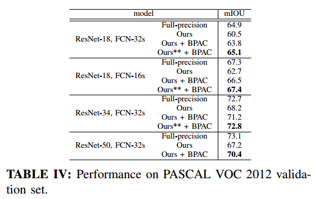

# Rethinking Binary Neural Network for Accurate Image Classification and Semantic Segmentation 
对提高图像分类和语分割的二值神经网络精度的重新思考
-------------

## **本文贡献**

1. 提出从结构近似的角度来设计精确的BNNs结构。具体地说，将网络分成组，并使用一组二进制基对每个组进行近似。还提出通过引入软连接（soft connections）来自动学习分解。

2. 提出的组网具有较强的可扩展性，可方便地转移到其他任务。本文提出了二值并行空洞卷积(BPAC)，它将丰富的多尺度上下文嵌入到BNNs中以实现精确的语义分割。与只使用组网相比，使用BPAC的组网在保持复杂性的同时显著提高了性能。

3. 使用ResNet并在ImageNet和PASCAL VOC数据集上对模型进行了评价。大量实验表明，该算法实现了精度与计算复杂度的最优平衡。从结果中， we also claim increasing  gradient paths(如更多的卷积核或短连接）对于BNNs的训练来说是必不可少的。

## **方法**
**1. Binarization function**
对于卷积层，定义了输入**x**权值滤波器**w**和输出**y**

Binarization of weights ：

Binarization of activations:

**Remark:**
大多数以往的BNNs集中在精确近似上，本文提出的是训练BNNs。

**2. Network Binary Decomposition**

 Layer-wise feature reconstruction:
 
 

 Complexity:
 
    
Group-wise feature approximation:

Learning to decompose: 

**3. Theoretically Computational Complexity analysis**

编码器上的二值化必然会对最终的预测造成较大的偏差。文中认为对于分割来说，获取多尺度信息是对任意尺度区域进行精确分类的关键，提出Binary Parallel Astrous Convolution
(BPAC). 

### **理论复杂度计算：**

## **实验结果**

**ImageNet分类**

**PASCAL VOC分割**

