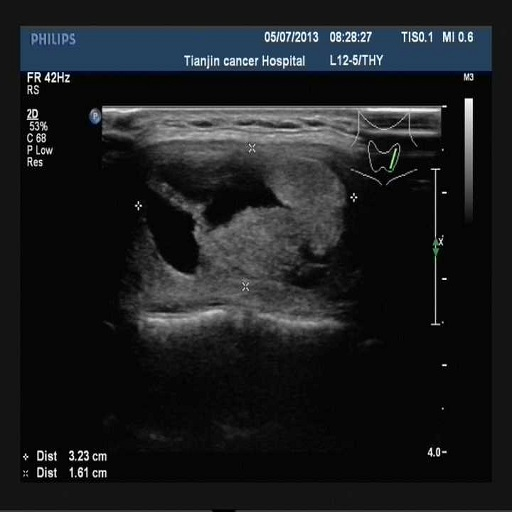

# 实验1

**实验意图与方向**：resize会损失图像信息，换一种方法将图像缩小至256×256。

**思路概述**：如下图，将512×512的大图中的每四个像素点取出来得到四个256×256小图，图像和掩码都这样处理，数据集也变为原来的四倍

**实验效果**：用FCN实验，原来的结果最高76.0，本次实验最高76.8。

**接下来的实验**：将池化层按照本次实验修改一下，原来的池化只取一个数，修改后的池化四个数全保留，通道变为原来的四倍。

-------------
# 实验2

**实验意图与方向**：减少池化层的信息损失。

**思路概述**：修改池化层暂时写不出来，将FCN中的池化层改为最大池化+平均池化。

**实验效果**：交并比变化并不大，单个效果图有好有坏，最终的结果为75.4和76.8，实验时交并比变化如下。

-------------
