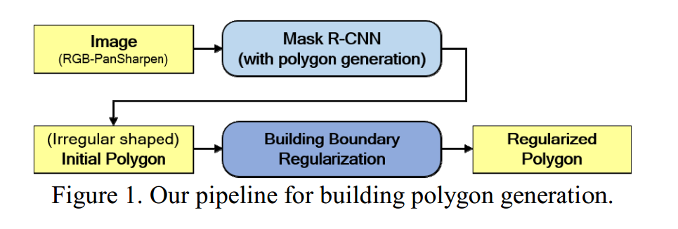
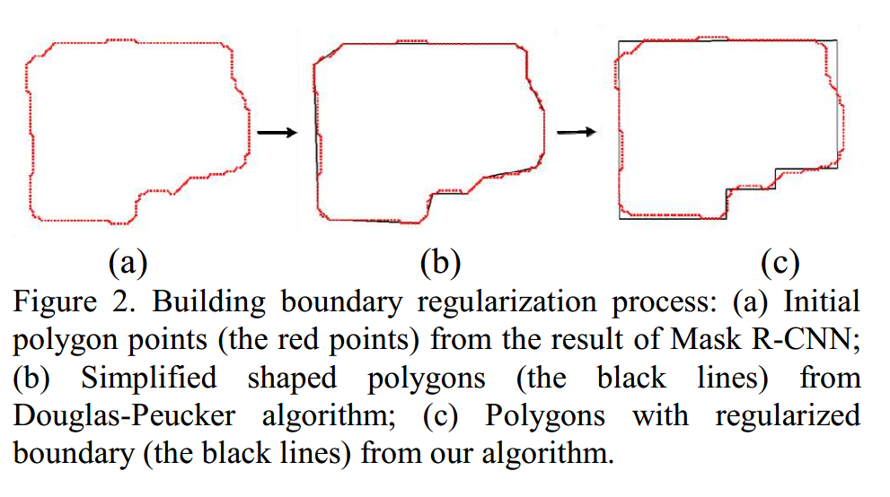

## 分享人

王帅杰 
  
## 论文标题
Building Extraction from Satellite Images Using Mask R-CNN with Building Boundary Regularization
    
## 论文背景
The DeepGlobe Building Extraction Challenge提出了在给定卫星图像中定位所有建筑多边形的问题。这一问题可以使用基于Mask R-CNN的现有实例分割算法来创建多边形。然而，由实例分割产生的多边形具有不规则的形状，这与实际的建筑边界有很大的不同，不能直接应用于许多制图和工程应用。

## 论文综述
   
### 研究问题
针对现有实例分割算法产生的多边形具有不规则的形状，本文提出了一种将Mask R-CNN与建筑边界正规化相结合的方法，来产生形状相对规则的边界。
    
### 关键方法
本文的流程图如下，对于输入的图像先用Mask R-CNN产生初始多边形边界，然后对多边形边界进行规则化。

本文主要是先使用自己训练的Mask R-CNN 来产生一个建筑多边形边界（此时的边界很不规则），然后利用Douglas-Peucker 算法来生成一个较规则的边界，最后使用MDL Optimization 生成最终的相对规则的边界。建筑边界变化如下图所示：

### 数据集
The DeepGlobe Building Extraction Challenge（DG-BEC），DG-BEC提供了包括Las Vegas, Paris, Shanghai, and Khartoum 在内的四个城市城市的卫星图像。有四种类型的图像，包括panchromatic (PAN), 8-band multi-channel (MUL), pan-sharpened version of RGB bands from the multispectral product (RGB-PanSharpen), and lastly pan-sharpened version of MUL (MUL-PanSharpen)。本文实验中只使用了RGB-PanSharpen这一种类型。

### 结论
the SpaceNet Building Detection Challenge 的第2轮被选为基线结果，下表描述了我们的F1值（单个城市与总分），与第3名冠军（Nofto、Wleite和xd_xd）相比。我们的算法在F1值上比其他的都好。
下表也与Mask R-CNN方法进行了比较。尽管Mask R-CNN 的f1值比我们的方法略高，但两种方法的两个f1值几乎是相等的。然而，本文的方法将多边形点的数量减少了86%，从而极大地简化了生成的多边形。这些多边形可以直接导入到许多应用程序中。

| Method    | Las Vegas|Paris    |Shang-hai |Khar-toum|  F1总分 |
| --------  | :-----:  | :----:  | :-----:  | :----:  | :----:  |
| Nofto     |  0.787   | 0.584   | 0.520    |0.424    | 0.579   |
| Wleite    |   0.829  | 0.679   | 0.581    |0.483    |  0.643   |
| XD_XD     | 0.885    | 0.745   | 0.579    |0.544    |  0.683  |
| Mask R-CNN|  0.881   | 0.760   | 0.646    |0.578    |  0.717 |
| Ours      |   0.879  | 0.753   | 0.642    |0.568    |  0.713  |